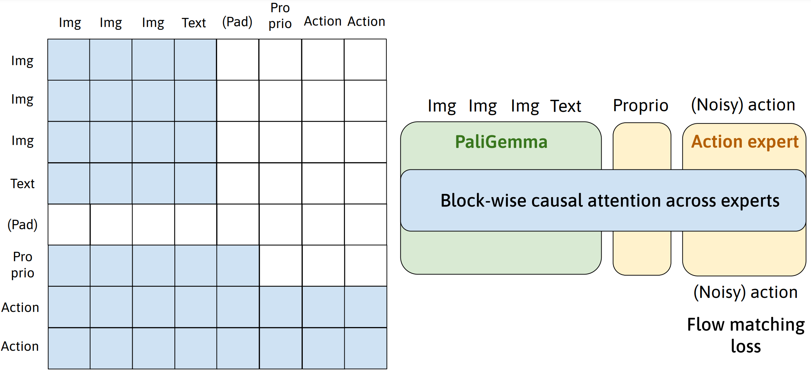

# open-pi-zero

This repo implements the [pi0](https://www.physicalintelligence.company/download/pi0.pdf) model from Physical Intelligence (Pi) based on my knowledge of the paper.

The model adopts a MoE-like architecture (or the recent [MoT](https://arxiv.org/abs/2411.04996), each expert has its own set of parameters and only interacts through attention), and uses a pre-trained 3B PaliGemma VLM (2.291B to be fine-tuned) and a new set of action expert parameters (0.315B). Block-wise causal masking is used such that VLM block attends to itself, proprioception (sharing weights with action) attends to itself and VLM, and action attends to all; each block is fully bidirectional within. The model is trained with flow matching loss on the action chunk output from the action expert.

If you find a bug or think I may have misunderstood part of the architecture based on the paper, please raise an issue or email me.



## Installation
1. Clone this repository at your directory. If running Simpler eval or trying out trained checkpoints, clone my Simpler fork (added proprio support) to the same directory:
```console
git clone https://github.com/allenzren/open-pi-zero
git clone https://github.com/allenzren/SimplerEnv --recurse-submodules
```

2. Install [uv](https://docs.astral.sh/uv/getting-started/installation/) and run the following in the repo directory:
```console
uv sync
uv pip install -e ../SimplerEnv
uv pip install -e ../SimplerEnv/ManiSkill2_real2sim
```
Or you may use venv or conda env instead of uv and run `pip install -e .` in all three directories.

3. Set environment variables `VLA_DATA_DIR` (if downloading datasets for training), `VLA_LOG_DIR`, and `VLA_WANDB_ENTITY` by running:
```console
source scripts/set_path.sh
```

4. Download PaliGemma weights at `TRANSFORMERS_CACHE`:
```console
cd $TRANSFORMERS_CACHE
git clone https://huggingface.co/google/paligemma-3b-pt-224
```

### Test text generation with pre-trained weights
```console
uv run src/model/vla/pizero.py --text_only --load_pretrained_weights --use_bf16
```

<!-- Note: Current implementation will be fully bfloat16 if `--use_bf16` is set. Pre-trained PaliGemma may lose some accuracy [issue](https://github.com/huggingface/transformers/pull/29402) but I assume it is okay if being used as the VLA backbone. -->

<!-- VLA with dummy img/text, proprio, and action, output dummy flow matching action
```console
uv run src/model/vla/pizero.py
``` -->

## Try checkpoints

I have only trained with either fractal or bridge dataset (unlabeled skipped) so far (training with mixed OXE data soon). Links to the models:
 [Bridge-Uniform](https://huggingface.co/allenzren/open-pi-zero/blob/main/bridge_uniform_step19296_2024-12-26_22-31_42.pt) | [Bridge-Beta](https://huggingface.co/allenzren/open-pi-zero/blob/main/bridge_beta_step19296_2024-12-26_22-30_42.pt) | [Fractal-Uniform](https://huggingface.co/allenzren/open-pi-zero/blob/main/fractal_uniform_step29576_2024-12-31_22-26_42.pt) | [Fractal-Beta](https://huggingface.co/allenzren/open-pi-zero/blob/main/fractal_beta_step29576_2024-12-29_13-10_42.pt)

Uniform and Beta denotes the mode for sampling flow matching timesteps during training: Uniform samples uniformly between 0 and 1, and Beta, proposed by Pi0, samples with higher density at earlier timesteps.

Run an trial in Simpler after downloading a checkpoint (see the list of tasks in the script)
```console
uv run scripts/try_checkpoint_in_simpler.py \
    --task google_robot_pick_horizontal_coke_can \
    --checkpoint_path ...fractal_beta.pt \
    --recording \
    --use_bf16 \
    --use_torch_compile # first batch will be slow
```

### Training details

The models were trained with learning rate 5e-5, global batch size 1024, and roughly 19k gradient steps with bridge (~12 epochs) and 30k with fractal (~8 epochs). Input to the model includes single image (256 tokens, no history), max 20 text tokens, 1 proprio token (no history), and 4 action tokens (chunk size 4). It takes roughly 1.5-2 days on one L40 node (per-GPU bsz 16 and thus gradient accumulation step 8), or 8-12 hours with H100s (bsz 32). torch.compile, bfloat16, and 8-bit optimizer were used to reduce VRAM usage (peak 40GB with bsz 16). Action and proprioception data were normalized in [-1, 1].

### Inference speed and VRAM usage

Inference involves one forward pass through PaliGemma (saving KV cache), and then 10 flow matching steps through the action expert. With RTX 4090:

| Setup | Time | Peak VRAM |
|:------:|:---------:| :---------:|
| float32 | 237ms | 13.6GB |
| bf16 | 245ms | 6.7GB |
| float32 + torch.compile | 89ms | 13.6GB |
| bf16 + torch.compile | 75ms | 6.7GB |
| Pi0 paper | 73ms* | - |

torch.compile mode is set to `default`. I also tried to use torch_tensorrt but compilation fails silently right now.

*From Table I of the paper. Note that my numbers are with single image input and action chunk size 4, while Pi uses three images and chunk size 50 according to the paper appendix.

### Eval results

For both set of environments I tried running all entire action chunk (size 4) or the first 2 steps only. Bridge policies work better with running all, while fractal policies work better with running 2 out 4. Note that bridge data is 5Hz and fractal data is 3Hz.

Success rates in **visual matching** setting in Simpler (results in visual aggregation setting coming soon)

| Policy | Dtype | Carrot on plate | Eggplant in basket | Spoon on towel | Stack cube |
|:------:|:-----:|:---------------:|:------------------:|:--------------:|:----------:|
| [Bridge-Uniform](https://huggingface.co/allenzren/open-pi-zero/blob/main/bridge_uniform_step19296_2024-12-26_22-31_42.pt)   | float32 | 58.8% | 79.2% | 63.3% | 21.3% |
| ^   | bf16 | 58.8% | 81.3% | 61.7% | 23.8% |
| [Bridge-Beta](https://huggingface.co/allenzren/open-pi-zero/blob/main/bridge_beta_step19296_2024-12-26_22-30_42.pt)    | float32 | 55.8% | 85.4% | 84.6% | 47.9% |
| ^    | bf16 | 52.5% | 87.9% | 83.8% | 52.5% |
<!-- uniform      58.8, 79.2, 63.3, 21.3 -->
<!-- uniform bf16 58.8, 81.3, 61.7, 23.8 -->
<!-- beta         55.8, 85.4, 84.6, 47.9 -->
<!-- beta bf16    52.5, 87.9, 83.8, 52.5 -->

| Policy | Dtype | Pick up Coke | Move Near | Close Drawer | Open Drawer | Open Top Drawer and Put Apple In |
|:------:|:-----:|:------------:|:---------:|:------------:|:-----------:|:--------------------------------:|
| [Fractal-Uniform](https://huggingface.co/allenzren/open-pi-zero/blob/main/fractal_uniform_step29576_2024-12-31_22-26_42.pt) | float32 | 88.0% | 80.3% | 66.7% | 45.2% | 52.2% |
| ^ | bf16 | 88.9% | 80.5% | 65.4% | 45.3% | 53.0% |
| [Fractal-Beta](https://huggingface.co/allenzren/open-pi-zero/blob/main/fractal_beta_step29576_2024-12-29_13-10_42.pt) | float32 | 97.9% | 78.7% | 75.0% | 49.5% | 46.6% |
| ^ | bf16 | 97.8% | 78.4% | 74.7% | 51.7% | 46.1% |
<!-- uniform      88.0, 80.3, 66.7, 45.2, 52.2 -->
<!-- uniform bf16 88.9, 80.5, 65.4, 45.3, 53.0 -->
<!-- beta         97.9, 78.7, 75.0, 49.5, 46.6 -->
<!-- beta bf16    97.8, 78.4, 74.7, 51.7, 46.1 -->

All numbers are averaged over 10 trials on top of prepackaged variations (robot/obj locations, URDFs, rgb_overlays) of each task in Simpler (total 240-2400 trials per task --- I see significant variations with <=3 seeds). Also note that these numbers may vary significantly among different checkpoints that are both mostly converged but from different epochs --- training with mixed datasets or using EMA might help.

Reason on evaluating with both bf16 and float32: While the model is trained with bf16, mixed precision, and no KV caching, during inference KV cache of VLM/Proprio is used. This leads to a distribution shift of the policy output when bf16 is used [(discussion)](https://github.com/huggingface/transformers/issues/25420#issuecomment-1775317535) compared to not using KV cache, estimated around 5e-4 to 2.5e-3 (out of the [-1, 1] normalization range) in avg L1 distance; difference is negligible when float32 is used in inference.

Disclaimer: Please do not associate the results here with possible results from Pi.

## Run training

### Download data

Download fractal data (following [OXE](https://github.com/google-deepmind/open_x_embodiment?tab=readme-ov-file))
```console
uv run gsutil -m cp -r gs://gresearch/robotics/fractal20220817_data/0.1.0   # at $VLA_DATA_DIR
```

Download bridge data (`bridge_dataset` folder) from [RAIL link](https://rail.eecs.berkeley.edu/datasets/bridge_release/data/tfds/) as suggested by OXE.

### Data pre-processing

Run [slurm/modify_rlds.sh](slurm/modify_rlds.sh) (taken from [rlds_dataset_mod](https://github.com/kpertsch/rlds_dataset_mod/tree/main)), which resizes the images to 224x224 for PaliGemma. Data shall be saved at `$VLA_DATA_DIR/resize_224`. It takes about 1 hour or so.

[Possible error](doc/error.md#5) | [Conventions on proprio / gripper actions](doc/convention.md)

### Training scripts

See examples in the [slurm](slurm/) folder. TFDS dataloading takes a growing amount of CPU RAM and roughly peaks at about 300-400GB in a node as each DDP process spawns a dataloader.

For further reducing VRAM usage, you may use (Q)LoRA by setting (`quantize=True` and) `lora=True`. However, the training performance may be affected. Or try [optimizer offloading](https://github.com/allenzren/open-pi-zero/blob/87b0f7acda9de6119c034fbfbde1d1867b1e57a4/src/agent/train.py#L170).

[Discussion on RAM](https://github.com/openvla/openvla/issues/4) | [Possible error if running quantization](doc/error.md#9) | [Observations / lessons from training](doc/notes.md)

## Run evaluation

### Simpler

See examples in the [slurm](slurm/) folder. Currently they use the dataset [statistics](config/bridge_statistics.json) generated by my training; you may update `env.adapter.dataset_statistics_path` in the config to the dataset statistics json file generated in your training, located in the dataset folder.

Note that while the provided checkpoints use `time_max_period=10000` and `action_expert_rope_theta=10000`, the updated training configs use `time_max_period=100` and `action_expert_rope_theta=1000` instead. Please update these values in the eval config if you evaluate newly trained checkpoints.


## File structure / naming

I implemented the model in a fairly modular way, so it is straightforward to add or remove any of the mixture models. `PiZero` class follows the original Pi0 architecture, while the underlying `JointModel` and `Mixture` classes form a general instantiation of the MoE + block-attention architecture.

```
src
 ├── agent
 │     ├── train.py             # training workspace
 │     ├── eval.py              # eval workspace (with Simpler)
 │     └── env_adapter
 │          ├── base.py
 │          └── simpler.py      # env obs pre-processing and action post-processing
 ├── data                       # training data pre-processing, mostly from Octo and dlimp
 └── model
       ├── paligemma            # mostly from open-source paligemma
       │    ├── siglip.py       # SigLIP and projector
       │    └── modules.py      # RoPE, MLP, RMSNorm
       └── vla
            ├── pizero.py       # PiZero: `joint_model` (Gemma and action expert), SigLIP, en/decoders
            ├── joint_model.py  # mixture of experts, run each expert and global attention
            ├── mixture.py      # individual `expert` following PaliGemma layout
            ├── modules.py      # action encoder, time embedding
            └── processing.py   # text tokenization and image normalization for PaliGemma
```

## Things to implement / try

Multi-image (history) as input. Switch to GPU Simpler. Fine-tuning by adding a new expert (e.g., second camera view into pre-trained DINO/SigLIP) and gradual unmasking. Co-training with (self-)supervision on modalities other than action. Set up PaliGemma 2.

## Acknowledgement

PaliGemma setup is largely adopted from [Open-source PaliGemma](https://github.com/hkproj/pytorch-paligemma/tree/main). Dataset loading is adopted from [Octo](https://octo-models.github.io/) and [dlimp](https://github.com/kvablack/dlimp). Dataset pre-processing is adopted from [rlds_dataset_mod](https://github.com/kpertsch/rlds_dataset_mod/tree/main). Other references: [Pi0](https://www.physicalintelligence.company/download/pi0.pdf), [OpenVLA](https://github.com/openvla/openvla), [Flow matching](https://github.com/gle-bellier/flow-matching/blob/main/Flow_Matching.ipynb), [Implementation by lucidrains](https://github.com/lucidrains/pi-zero-pytorch), [SimplerEnv](https://github.com/simpler-env/SimplerEnv), [QLoRA-LLM](https://github.com/michaelnny/QLoRA-LLM)

Special thanks to [Asher Hancock](https://aasherh.github.io/) for the discussion on block-wise causal masking.
